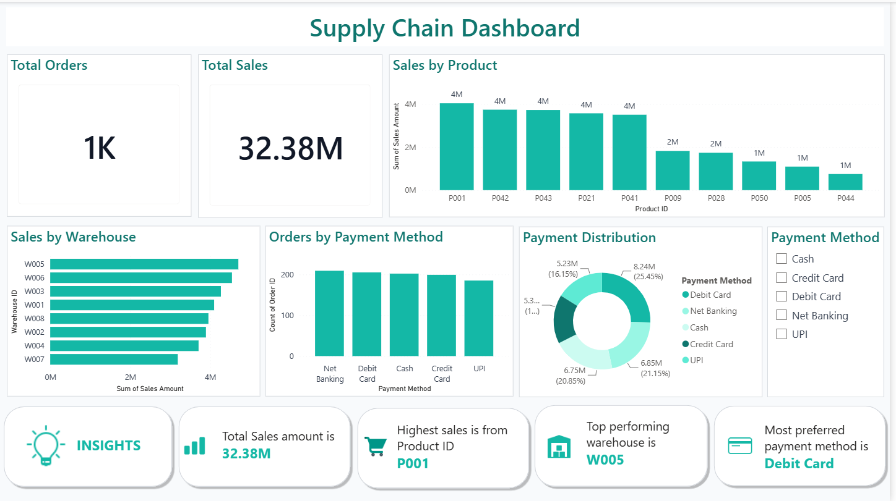

# Supply Chain Dashboard using Power BI

## Project Overview

This project presents a Supply Chain Dashboard built using Power BI. The dashboard helps analyze sales performance, warehouse performance, payment methods, and product-wise sales.

---

## Dashboard Features

- Total Orders KPI
- Total Sales KPI
- Sales by Product
- Sales by Warehouse
- Orders by Payment Method
- Payment Distribution
- Interactive Payment Method Slicer
- Business Insights Cards

---

## Tools Used

- Power BI
- Microsoft Excel

---

## Dataset

The dataset contains:

- Orders
- Products
- Customers
- Warehouses
- Payment Methods
- Suppliers

---

## Dashboard Preview

---

## Key Insights

- Total Sales: 32.38M
- Total Orders: 1K
- Highest Selling Product: P001
- Top Warehouse: W005
- Most Preferred Payment Method: Debit Card

---

## Author

Swetha Fastyna
